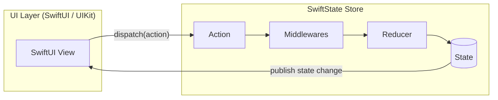

# SwiftState 🚀

[](https://developer.apple.com/swift/)
[](https://developer.apple.com/discover/)
[](LICENSE)

**SwiftState** is a lightweight, modern, and type-safe state management library for Swift and SwiftUI, built on modern Swift Concurrency features. It implements a predictable unidirectional data flow (Redux/MVI) and features a stunning, interactive **Time Travel Debugger Panel** that overlays directly onto your app.

---

## Key Features

- 🏎️ **Modern Swift Concurrency**: Native thread-safety using `@MainActor` and Sendable types.
- 🕒 **Time Travel Engine**: Automatic history recording with full `undo()`, `redo()`, and manual scrubbing (jumping to any point in time).
- 🧭 **Clean History Timeline**: Only records real state transitions, exposes combined state/action entries, and lets you reset history around the current state.
- 🧬 **Flexible Middlewares**: Intercept actions before they reach reducers (e.g., logging, network synchronization).
- 📺 **Glassmorphic SwiftUI Debugger**: A premium floating console with timeline scrubbing and live JSON state inspection that can be toggled on debug builds.
- ⚙️ **Optimized Render Updates**: Only triggers SwiftUI view updates when the state changes (via `Equatable` checks).

---

## Architectural Data Flow



---

## Installation

### Swift Package Manager (SPM)

Add SwiftState to your project dependencies via Xcode or append it directly to your `Package.swift` file:

```swift
dependencies: [
    .package(url: "https://github.com/ChiefVenzox/SwiftState.git", from: "1.0.0")
]
```

---

## Quick Start Guide

### 1. Define State and Actions

Your application state must conform to `State` (which requires `Codable` and `Equatable`). Actions must conform to `Action`.

```swift
import SwiftState

struct AppState: State {
    var counter: Int = 0
    var textInput: String = ""
}

enum AppAction: Action {
    case increment
    case decrement
    case changeText(String)
}
```

### 2. Create a Reducer

Reducers are pure functions using the `inout` state pattern, making state mutation clean and simple:

```swift
let appReducer: Reducer<AppState> = { state, action in
    guard let action = action as? AppAction else { return }
    switch action {
    case .increment:
        state.counter += 1
    case .decrement:
        state.counter -= 1
    case .changeText(let newText):
        state.textInput = newText
    }
}
```

### 3. Initialize the Store

For production, you can use the standard `Store`. For development, use `TimeTravelStore` to enable history tracking:

```swift
import SwiftUI
import SwiftState

@main
struct MyApp: App {
    // Enable time travel tracking in debug mode with custom logging middleware
    @StateObject private var store = TimeTravelStore(
        initialState: AppState(),
        reducer: appReducer,
        middlewares: [createLoggerMiddleware()]
    )
    
    var body: some Scene {
        WindowGroup {
            ContentView()
                .environmentObject(store)
        }
    }
}
```

### 4. Wire Up Your Views & Add Debugger

Access the store using `@EnvironmentObject` and dispatch actions inside SwiftUI buttons. Add `TimeTravelDebuggerView` as an overlay in debug builds:

```swift
struct ContentView: View {
    @EnvironmentObject var store: TimeTravelStore<AppState>
    
    var body: some View {
        ZStack {
            VStack(spacing: 20) {
                Text("Counter: \(store.state.counter)")
                    .font(.largeTitle)
                
                HStack(spacing: 16) {
                    Button("Decrement") {
                        store.dispatch(AppAction.decrement)
                    }
                    Button("Increment") {
                        store.dispatch(AppAction.increment)
                    }
                }
                
                TextField("Type something...", text: Binding(
                    get: { store.state.textInput },
                    set: { store.dispatch(AppAction.changeText($0)) }
                ))
                .textFieldStyle(.roundedBorder)
                .padding()
            }
            
            #if DEBUG
            // Floating, draggable glassmorphic debugger panel!
            TimeTravelDebuggerView(store: store)
            #endif
        }
    }
}
```

---

## Core API Reference

### `Store<S>`
The base class managing the state.
- `state`: The read-only state.
- `dispatch(action)`: Dispatches an action.

### `TimeTravelStore<S>`
Extends `Store` to capture history entries.
- `undo()`: Steps back in time.
- `redo()`: Steps forward in time.
- `jump(to: Int)`: Jumps to a specific history state.
- `clearHistory()`: Clears recorded history while keeping the current state as the new initial entry.
- `history`: Array of all recorded states.
- `actionHistory`: Array of actions leading to states.
- `historyEntries`: Combined timeline entries with `index`, `state`, and optional `action`.
- `maxHistoryLimit`: The state history cap. Values lower than `1` are safely clamped.
- `canUndo` / `canRedo`: Control status flags.

SwiftState records only actions that actually change the state, so ignored actions do not clutter the debugger timeline:

```swift
store.dispatch(AppAction.increment)   // recorded
store.dispatch(AppAction.noop)        // not recorded if state stays equal

for entry in store.historyEntries {
    if entry.isInitialState {
        print("Initial:", entry.state)
    } else {
        print("#\(entry.index)", entry.action!, entry.state)
    }
}
```

### `TimeTravelHistoryEntry<S>`
Represents a readable timeline item.
- `index`: The state position in the timeline.
- `state`: The captured state at that position.
- `action`: The action that produced the state, or `nil` for the initial state.
- `isInitialState`: Convenience flag for the first entry.

### `createLoggerMiddleware()`
A built-in middleware printing beautiful emojis, execution time, action name, and old/new state details to the console during development.

---

## License

SwiftState is released under the MIT License. See [LICENSE](LICENSE) for details.
